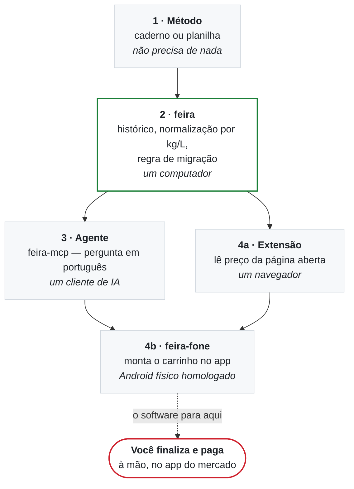

<p align="center">
  
</p>

<p align="center">
  <a href="https://github.com/yolo-labz/feira/actions/workflows/ci.yml"></a>
  <a href="LICENSE"></a>
</p>

# feira

**Um agente que pesquisa preço dentro dos aplicativos de entrega, no seu
celular, monta o carrinho — e para. Você confere e finaliza a compra com o dedo,
no app.**

Ele não para porque não conseguiu ir adiante. Para porque essa é a fronteira, e
ela é código: tocar num botão de pagamento é recusado, e no servidor MCP a
ferramenta de pagar **não existe**.

> **Estado real, hoje:** o `feira-fone` é **experimental** — exercitado numa
> casa, num aparelho, sem release publicada e sem lista de aplicativos
> suportados. As camadas de baixo (o método e o CLI) são estáveis e funcionam
> sozinhas. Leia isto antes de esperar um botão que ainda não existe.

<a href="#a-demo">Ver funcionando →</a> &nbsp;·&nbsp;
<a href="#o-que-precisa-para-o-ciclo-completo">O que precisa</a> &nbsp;·&nbsp;
<a href="#instalação">Instalar</a> &nbsp;·&nbsp;
<a href="docs/02-o-metodo.md">Começar sem instalar nada</a>

---

## A demo

Uma gravação de verdade: um celular Android de verdade, lendo a tela de verdade,
e recusando o pagamento de verdade no fim.


O ciclo inteiro, em cinco comandos:

| | |
|---|---|
| `feira-fone dispositivos` | um aparelho físico, homologado. Emulador não serve |
| `feira-fone tela` | lê os preços **da tela do app**, não de um catálogo |
| `feira compare` | decide — e aqui a etiqueta mais barata **perde** |
| `feira-fone tocar` | monta o carrinho, e confere que a tela mudou |
| `feira-fone tocar 'Pagar'` | **RECUSADO** |

Repare no terceiro passo, que é onde o dinheiro está: o óleo de **900 ml a
R$ 7,49** sai a **R$ 8,32 por litro**; o de **1 litro a R$ 7,90** sai a
**R$ 7,90**. A etiqueta menor é 5% mais cara. E, mesmo tendo achado o mais
barato, o veredito é **MANTER** — 5,1% não paga a troca de mercado.

Um agente que só busca "o mais barato" erra as duas coisas.

> **A vitrine é de mentira, o resto não é.** Os produtos vêm de
> [`vitrine-fixture.html`](docs/assets/source/vitrine-fixture.html), uma página
> com os mesmos itens de exemplo do `template/`. Gravar contra um aplicativo de
> entrega real significaria abrir a conta de alguém — com endereço e histórico
> de pedidos — para fazer material de divulgação, e dirigir o app de um terceiro
> para isso. O `feira-fone`, o `adb`, a leitura da tela e a recusa são reais.
> Quadro estático: [`demo-fone.png`](docs/assets/rendered/demo-fone.png).
> Gravação: [`demo-fone.cast`](docs/assets/source/demo-fone.cast).

## O que precisa para o ciclo completo

**Um celular Android físico**, homologado pelo Google Play, com depuração USB
ligada e ligado à máquina. **Nos aplicativos e ambientes aferidos em
25/08/2026**, emuladores não concluíram o fluxo de pagamento — alguns apps
exigem aparelho físico homologado através de verificações como o Play Integrity,
cada app decide a própria política, e isso pode mudar.
[O levantamento](docs/pesquisa/harness-de-login.md), com o que foi e o que não
foi testado.

> ⚠️ **Use só a sua própria conta, e leia os termos do aplicativo.** Automatizar
> app de terceiro pode contrariar os termos de uso dele; a consequência
> realista é a conta ser bloqueada, e a conta é sua. Ver o
> [aviso legal](DISCLAIMER.md).

**Sem o aparelho, nada disso é desperdício.** As camadas de baixo respondem *o
que comprar e onde* sozinhas, num computador comum — o que falta é só quem
aperta os botões. É por elas que vale começar, e é a partir daqui que este
README trata delas.

## Em 30 segundos

Você registra o que pagou — digitando, ou importando a nota fiscal eletrônica
(NFC-e) que o mercado já emite. O `feira` divide cada preço pelo conteúdo da
embalagem e responde **uma** pergunta: *vale a pena mudar alguma coisa?*

Na maior parte das semanas a resposta é **não**, e ele diz isso. Trocar de
mercado custa frete, pedido mínimo e tempo — por isso existe um limiar, e por
isso o veredito mais comum é *não mude nada*.

A pesquisa de preço acontece **nas suas próprias contas**: a
[extensão](extensao/) lê a página que você abriu, e o `feira-fone` lê os
aplicativos de entrega no seu celular. Nada disso é um servidor consultando um
catálogo por aí — é o que a sua conta vê, no seu aparelho: o `feira` não chama
serviço externo nenhum; quem fala com a rede são o seu navegador e os apps do
seu celular, na sua sessão.

**O que ele nunca faz:** comprar, pagar, ou prometer uma porcentagem de
economia.

O [**método**](docs/02-o-metodo.md) funciona numa planilha, sem instalar nada. O
software só automatiza a conta.

## O CLI, sem celular nenhum


Duas coisas acontecem aí, e as duas importam:

1. **A ordem inverteu** — o caso do óleo, agora com as três amostras de cada
   mercado e a mediana.
2. **Mesmo assim, ele manda ficar onde está.** A política padrão não recomenda
   trocar abaixo de 8% de diferença, com pelo menos 3 observações no mercado
   desafiante. [Por que esses números](skills/feira-precos/referencia/regra-de-migracao.md).

Essa segunda parte é o produto. A primeira é aritmética.

> Os números saem dos dados de exemplo em `template/` — rode
> `feira compare oleo-de-soja` e você vê exatamente a mesma coisa. Quadro
> estático: [`demo.png`](docs/assets/rendered/demo.png). Gravação original em
> asciicast: [`demo.cast`](docs/assets/source/demo.cast).

## Instalação

O CLI precisa de Python 3.9+ e nada mais — sem `pip install`, sem ambiente
virtual, sem dependência de runtime. (A extensão de navegador é separada e
opcional; veja o [README dela](extensao/README.md).)

**Ler antes de executar** — é o caminho recomendado, e o script foi escrito para
isso:

```sh
curl -fsSL https://raw.githubusercontent.com/yolo-labz/feira/main/install.sh -o install.sh
less install.sh                    # ~250 linhas, sem minificação
sh install.sh --dry-run            # mostra tudo que faria, sem escrever nada
sh install.sh
```

Se você confia no repositório e quer uma linha só:

```sh
curl -fsSL https://raw.githubusercontent.com/yolo-labz/feira/main/install.sh | sh
```

O instalador se recusa a rodar como root, instala só dentro do seu `$HOME`, não
edita nenhum arquivo de shell seu, imprime o SHA-256 do que baixou e roda um
autoteste no fim.

Ainda **não há release publicada** — o padrão é o `main`, que é conteúdo
mutável. Enquanto isso, dá pra fixar exatamente o que você leu:

```sh
sh install.sh --version <sha-do-commit-que-você-leu>
FEIRA_SHA256=<hash-que-você-esperava> sh install.sh   # aborta se não bater
```

Primeiro resultado, em menos de um minuto:

```sh
feira init ~/minha-feira
cd ~/minha-feira
feira advise
```

O repositório já vem com dados de exemplo, então `feira advise` responde alguma
coisa desde o primeiro minuto.

## Começar pelas notas que você já tem

Você não precisa digitar meses de compra para o `feira` ter o que dizer. Baixe
os XML das suas notas fiscais no portal da SEFAZ do seu estado e aponte a pasta:

```sh
feira nfce ~/notas             # lê e mostra, sem gravar nada
feira nfce ~/notas --importar  # grava como observações
```

A leitura é local: o `feira` abre o arquivo que você baixou e não fala com a
SEFAZ nem com ninguém. **Importar duas vezes é seguro** — cada nota é gravada
com a chave de acesso, e a segunda passada pula o que já entrou:

```
imported 0 observations into dados/observacoes.csv
skipped 3 receipt(s) already imported — matched by access key
```

Depois de importar, os nomes vêm do jeito que o mercado digitou —
`ol-soja-liza-900` e `oleo-soja-liza-900ml` são o mesmo óleo, e enquanto
estiverem separados cada um conta como uma amostra só.
[Como juntar](docs/how-to/casar-skus.md) leva dez minutos, uma vez.

## O que a casa comprou, e quando

```sh
feira historico                    # gasto por mês
feira historico oleo-de-soja       # a linha do tempo de um item
feira historico --desde 2026-01-01 --mercado atacarejo-online
```

```
  2026-07      R$ 72,81  ██████████                2 itens, 3 mercado(s)
  2026-08     R$ 168,57  ████████████████████████  3 itens, 3 mercado(s)

  oleo-de-soja — 6 compras

    15/07/2026           0.900 L      R$ 7,49  mercado-do-bairro
    19/07/2026    +4d    1.000 L      R$ 7,90  atacarejo-online
    …
    reposição observada: mediana 0.129 L/dia, mais lenta 0.100
    (ritmo de COMPRA, não de consumo — promoção e estoque mexem nisso)
```

## O que talvez esteja faltando

```sh
feira falta
```

```
  CONFERIR NA DESPENSA
    oleo-de-soja        contou 1 há 7 dia(s); num ritmo lento para esta casa
                        isso já alcança o ponto de recompra

  SEM BASE AINDA (2 itens)
    arroz-tio-joao-1kg  ritmo irregular demais para estimar — o mais rápido
                        observado foi 11.7× o mais lento
    papel-higienico-30m 2 compra(s) nos últimos 365 dias, 1 ciclo(s)
```

**Uma compra prova que alguém comprou, não que a casa consumiu.** Estoque,
promoção, visita e viagem mexem no intervalo entre as compras, então este
comando nunca diz que algo acabou, nunca chuta quanto resta e nunca dá uma data.
Ele diz **onde vale a pena olhar**.

Ele cala a boca com facilidade, e isso é o recurso funcionando:

| responde `COLETAR` quando | por quê |
|---|---|
| menos de 6 compras no último ano | uma ida ao mercado decidiria a resposta sozinha |
| não há contagem **datada** na despensa | um número sem data não diz se você contou hoje ou em março |
| o ritmo mais rápido passa de 3× o mais lento | aí não há ritmo — o número seria fruto do maior intervalo, não da casa |
| a contagem e as compras estão em unidades diferentes | comparar litro com unidade dá um número, nunca uma resposta |

O exemplo do arroz acima é de propósito: quem compra saco de 5 kg no atacarejo
**e** pacote de 1 kg na esquina tem dois ritmos misturados, e o programa admite
que não sabe separá-los em vez de inventar uma média.

E a estimativa se apoia num **ritmo lento** da casa — um quartil baixo, não a
mediana e não o mínimo. O mínimo parece a escolha conservadora e é uma armadilha:
ele só pode cair conforme você registra mais compras, então o programa ficaria
mais calado quanto mais aprendesse, e uma viagem de duas semanas calaria o item
para sempre. Tem um teste no `feira selftest` que quebra se alguém trocar de volta.

## Mandar o pedido para o vendedor

Boa parte do mercado de bairro não tem site — tem um número de WhatsApp. O
`feira` escreve a mensagem; **enviar é com você**:

```sh
feira zap                  # o pedido do que está faltando
feira zap oleo-de-soja     # uma pergunta de preço
```

Ele imprime o texto e o comando pronto para o
[`wa`](https://github.com/yolo-labz/wa) — um daemon de WhatsApp com lista de
permissão por número, limite de taxa sem `--force` e registro do que saiu. O
`feira` não tem código de rede, não guarda o seu número e não consegue enviar
nada: [a mesma fronteira do pagamento](docs/how-to/whatsapp-com-o-wa.md), pelo
mesmo motivo.

## Onde a fronteira fica, e por quê

```
  agente  →  celular  →  apps de entrega  →  preços → histórico
                                                          ↓
              você finaliza  ←  carrinho montado  ←  decisão
```

Um agente que erra uma compra apaga em confiança o que muitas compras certas
construíram, e quem discute com o mercado e com a operadora do cartão é você.
**Não é limitação técnica — é onde a fronteira foi posta de propósito.**

Ela existe em três alturas diferentes, e nenhuma delas é um parágrafo de README:

| Onde | O que impede |
|---|---|
| `feira-fone` | tocar num botão de pagamento é recusado sem `--eu-confirmo` **naquela invocação**; não existe modo "confirmar sempre" |
| `feira-mcp` | a ferramenta de pagar **não existe** — não há portão para um modelo contornar, nem aprovação para forjar |
| `feira` | não tem código de rede: não fala com mercado, com API nem com servidor nenhum |

A terceira linha é a mais forte das três, e é a mais fácil de subestimar:
**segurança por ausência de capacidade.** Um teste garante que nenhuma
ferramenta MCP consiga pedir ou pagar, e ele foi validado ao contrário —
plantando uma ferramenta de pagamento falsa para ver o teste quebrar.

[Como montar a camada do celular](skills/feira-pedido/referencia/tier-3-android.md).

## Por que não é mais um comparador de preços

| | Comparador de preços | `feira` |
|---|---|---|
| De onde vem o preço | anunciado pela loja | **o que você pagou** (nota fiscal) e o que a **sua conta** vê no app |
| O que ele sabe da sua casa | nada | o que vocês consomem e a que preço |
| A quem ele serve | à loja que paga o anúncio | à sua casa |
| A resposta honesta, na maioria das semanas | "compre aqui" | "**não mude nada**" |
| Onde ficam os dados | no servidor dele | na sua máquina, em texto puro |

## As quatro camadas

Cada camada acrescenta à anterior. As duas primeiras já economizam dinheiro
sozinhas e não exigem nada; a quarta é onde o ciclo fecha.



**Em prosa, para quem usa leitor de tela:** o método (camada 1) não precisa de
nada além de papel. O `feira` (camada 2) automatiza a aritmética dele num
computador. Em cima disso, um agente de IA consulta os dados pelo `feira-mcp`
(camada 3), uma extensão captura preços da página que você já está vendo (4a), e
o `feira-fone` pesquisa preço dentro dos aplicativos de entrega no seu celular e
monta o carrinho (4b) — que é onde o ciclo fecha. **O software para antes do
pagamento**: finalizar e pagar é sempre a pessoa, à mão, no app do mercado.
Detalhes em [as quatro camadas](docs/explicacao/camadas.md).

## Conversar com ele

O `feira` sozinho não fala com nenhuma IA. Ele expõe um **servidor MCP**
(`feira-mcp`) que clientes compatíveis com o protocolo podem consultar — o
cliente cuida da conversa, do modelo e da conta; o `feira` cuida dos dados.

Assim o **`feira` não pede chave de API a ninguém** — e o servidor fala só pela
entrada e saída padrão, com o cliente na sua máquina, sem abrir porta de rede.
(O cliente de IA que você escolher pode pedir a chave dele.)

**O servidor MCP não tem ferramenta de pedido nem de pagamento.** Não é uma
confirmação que dá pra convencer o modelo a pular: a capacidade não existe, e
[um teste falha](tests/test_mcp.py) se alguém adicionar uma. Passo a passo em
[como conversar](docs/explicacao/como-conversar.md).

## Documentação

| # | Documento | Para quem |
|---|---|---|
| 1 | [O caso](docs/01-o-caso.md) | qualquer pessoa — o que é, com números reais |
| 2 | [**O método**](docs/02-o-metodo.md) ⭐ | **quem quer fazer** — funciona sem software |
| 3 | [Apêndice técnico](docs/03-apendice-tecnico.md) | quem vai instalar e mexer |

Com 20 minutos e nenhuma vontade de instalar nada, leia só **o método**. É a
parte que não depende de tecnologia, e é a parte que economiza dinheiro.

Também: [privacidade](docs/explicacao/privacidade.md) ·
[a extensão](extensao/README.md) ·
[a camada do celular](skills/feira-pedido/referencia/tier-3-android.md) ·
[pesquisa](docs/pesquisa/) · [identidade visual](DESIGN.md)

## Estado, sem maquiagem

Versão 0.1.0, **sem release publicada**. Roda diariamente numa casa em Recife
desde maio de 2026. **Não há instalação externa conhecida** — se você for a
primeira, [abra uma issue](https://github.com/yolo-labz/feira/issues) contando o
que quebrou. É a contribuição mais útil possível agora.

As camadas não estão no mesmo ponto, e vale saber qual é qual antes de contar
com alguma:

| Camada | Estado |
|---|---|
| o método, numa planilha | estável — não depende deste repositório para nada |
| `feira` (CLI) | estável, com suíte de testes que roda no CI |
| `feira-mcp` | estável; 11 ferramentas, nenhuma capaz de pedir ou pagar |
| extensão de navegador | funciona, sem loja — carregada como extensão sem empacotar |
| `feira-fone` (o celular) | **experimental** — uma casa, um aparelho, sem lista de apps suportados |

A demo do celular é uma gravação real, mas contra uma vitrine de mentira. Nenhum
aplicativo de entrega real foi automatizado para produzir material deste
repositório.

**O que ainda não foi medido:** nenhuma economia foi apurada contra uma linha de
base controlada. O projeto não promete porcentagem, e
[o caso](docs/01-o-caso.md#o-que-ainda-não-está-provado) diz exatamente o que
falta para poder afirmar mais.

## Verificar

```sh
sh tests/run.sh
```

Sem rede, sem celular, sem navegador. Cinco suítes, e o que cada uma protege:

| Suíte | Falha se… |
|---|---|
| unidades e regra | `900ml` parar de virar 0,9 L, ou a regra de 8%/3 amostras mudar sem querer |
| `feira-fone` | um botão de pagamento deixar de ser recusado |
| `feira-mcp` | surgir uma ferramenta MCP capaz de pedir ou pagar |
| extensão | o coletor ler o preço como nome de produto, ou errar `6x350ml` |
| template | um repositório recém-criado não responder aos comandos |

`make check` roda isso mais as verificações de asset (contraste, orçamento de
peso, texto alternativo). Como contribuir: [CONTRIBUTING.md](CONTRIBUTING.md).

## Licença

[Apache-2.0](LICENSE) · [aviso legal](DISCLAIMER.md) — curto, e vale ler antes de
automatizar qualquer coisa que gaste dinheiro.

---

### In English

**feira** is an agent that researches prices **inside the delivery apps on a
phone you own**, builds the cart, and then stops. You check it and tap pay
yourself.

It does not stop because it ran out of road. That last step is a deliberate
boundary: an agent that gets one order wrong costs more in trust than the method
saves in a month, and it is you, not the software, who argues with the shop and
the card issuer. The boundary is code — `feira-fone` refuses to tap a payment
button without `--eu-confirmo` on that exact invocation, and the MCP server has
no payment tool to reach for at all.

The phone layer is **experimental**: exercised in one household, on one handset,
with no release and no declared list of supported apps. It also needs real
hardware — a Play-certified Android handset; **in the apps and environments
tested on 25/08/2026**, emulators did not complete the payment flow.

Underneath it, and useful on their own with no phone at all, are the parts that
decide *what* to buy and *where*: it compares what your household actually paid —
typed in, parsed from Brazilian NFC-e electronic receipts, or read from the apps —
normalised to price per kg/L/unit, and only recommends switching shops when the
gap clears a threshold (8% by default) with enough samples (3). Most weeks it
says *stay put*, which is the point.

Plain-text data, stdlib Python, zero runtime dependencies, no API key. The
installed tool makes **no network calls**. It ships an MCP server over stdio with
**no ordering or payment tool at all** — a test enforces that absence. Ordering
can be assisted on a physical Android phone, but a human always taps pay.

**Maturity:** 0.1.0, **no release published**, and **no savings have been
measured against a controlled baseline** — the project deliberately promises no
percentage. The CLI and the method are stable; the phone layer is experimental.
There is no known external installation yet.

Docs are Portuguese-first because the domain is Brazilian retail. The
[method](docs/02-o-metodo.md) works on a spreadsheet with no software at all.
