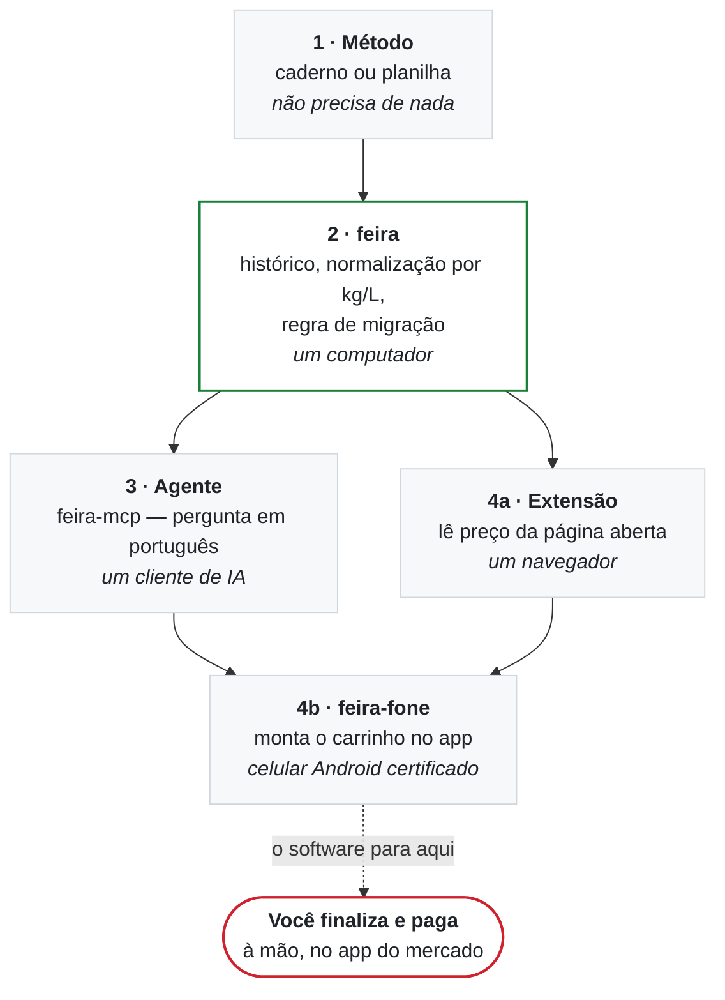

<p align="center">
  
</p>

<p align="center">
  <a href="https://github.com/yolo-labz/feira/actions/workflows/ci.yml"></a>
  <a href="LICENSE"></a>
</p>

# feira

**Compara o preço que a sua casa pagou por mercado — normalizado por quilo, litro
ou unidade — e só recomenda trocar de mercado quando a diferença compensa a
troca.**

Um exemplo, dos dados que acompanham o projeto: óleo de **900 ml a R$ 7,49** sai
a **R$ 8,32 por litro**; o de **1 litro a R$ 7,90** sai a **R$ 7,90 por litro**.
O da etiqueta menor é 5% mais caro. Comparar etiqueta com etiqueta escolhe
errado, e nada no recibo avisa.

O [**método**](docs/02-o-metodo.md) funciona numa planilha, sem instalar nada — é
a camada que economiza dinheiro. O software só automatiza a conta.

> **Não faz compra e não paga nada.** Quem finaliza e paga é você, à mão, no
> aplicativo do mercado. E o `feira` instalado **não faz nenhuma chamada de
> rede**: os seus dados ficam na sua máquina.

<a href="docs/02-o-metodo.md"><b>Começar sem instalar nada →</b></a> &nbsp;·&nbsp;
<a href="#instalação">Instalar</a> &nbsp;·&nbsp;
<a href="#a-demo">Ver funcionando</a>

---

## Em 30 segundos

Você registra o que pagou — digitando, ou importando a nota fiscal eletrônica
(NFC-e) que o mercado já emite. O `feira` divide cada preço pelo conteúdo da
embalagem e responde **uma** pergunta: *vale a pena mudar alguma coisa?*

Na maior parte das semanas a resposta é **não**, e ele diz isso. Trocar de
mercado custa frete, pedido mínimo e tempo — por isso existe um limiar, e por
isso o veredito mais comum é *não mude nada*.

**O que ele nunca faz:** consultar preço na internet por conta própria, comprar,
pagar, ou prometer uma porcentagem de economia. (A [extensão](extensao/) lê
preços — mas só da página que **você** abriu, quando **você** clica.)

## A demo


Duas coisas acontecem aí, e as duas importam:

1. **A ordem inverteu** — o caso do óleo lá de cima, agora com as três amostras
   de cada mercado e a mediana.
2. **Mesmo assim, ele manda ficar onde está.** A política padrão não recomenda
   trocar abaixo de 8% de diferença, com pelo menos 3 observações no mercado
   desafiante. [Por que esses números](skills/feira-precos/referencia/regra-de-migracao.md).

Essa segunda parte é o produto. A primeira é aritmética.

> Os números da demo saem dos dados de exemplo em `template/` — rode
> `feira compare oleo-de-soja` e você vê exatamente a mesma coisa. Quadro
> estático: [`demo.png`](docs/assets/rendered/demo.png). Gravação original em
> asciicast: [`demo.cast`](docs/assets/source/demo.cast).

## Instalação

O CLI precisa de Python 3.9+ e nada mais — sem `pip install`, sem ambiente
virtual, sem dependência de runtime. (A extensão de navegador é separada e
opcional; veja o [README dela](extensao/README.md).)

**Ler antes de executar** — é o caminho recomendado, e o script foi escrito para
isso:

```sh
curl -fsSL https://raw.githubusercontent.com/yolo-labz/feira/main/install.sh -o install.sh
less install.sh                    # ~250 linhas, sem minificação
sh install.sh --dry-run            # mostra tudo que faria, sem escrever nada
sh install.sh
```

Se você confia no repositório e quer uma linha só:

```sh
curl -fsSL https://raw.githubusercontent.com/yolo-labz/feira/main/install.sh | sh
```

O instalador se recusa a rodar como root, instala só dentro do seu `$HOME`, não
edita nenhum arquivo de shell seu, imprime o SHA-256 do que baixou e roda um
autoteste no fim.

Ainda **não há release publicada** — o padrão é o `main`, que é conteúdo
mutável. Enquanto isso, dá pra fixar exatamente o que você leu:

```sh
sh install.sh --version <sha-do-commit-que-você-leu>
FEIRA_SHA256=<hash-que-você-esperava> sh install.sh   # aborta se não bater
```

Primeiro resultado, em menos de um minuto:

```sh
feira init ~/minha-feira
cd ~/minha-feira
feira advise
```

O repositório já vem com dados de exemplo, então `feira advise` responde alguma
coisa desde o primeiro minuto.

## Por que não é mais um comparador de preços

| | Comparador de preços | `feira` |
|---|---|---|
| De onde vem o preço | anunciado pela loja | **o que você pagou**, da sua nota fiscal |
| O que ele sabe da sua casa | nada | o que vocês consomem e a que preço |
| A quem ele serve | à loja que paga o anúncio | à sua casa |
| A resposta honesta, na maioria das semanas | "compre aqui" | "**não mude nada**" |
| Onde ficam os dados | no servidor dele | na sua máquina, em texto puro |

## As quatro camadas

Comece pela primeira. Cada uma é opcional em cima da anterior, e **a maior parte
do valor está nas duas primeiras**.



**Em prosa, para quem usa leitor de tela:** o método (camada 1) não precisa de
nada além de papel. O `feira` (camada 2) automatiza a aritmética dele num
computador. Em cima disso, um agente de IA pode consultar os dados pelo
`feira-mcp` (camada 3), uma extensão pode capturar preços da página que você já
está vendo (4a), e o `feira-fone` pode montar o carrinho no aplicativo do mercado
(4b). **O software para antes do pagamento**: finalizar e pagar é sempre a
pessoa, à mão. Detalhes em [as quatro camadas](docs/explicacao/camadas.md).

Sobre a 4b: **emulador não resolve.** Aplicativos de entrega brasileiros que
guardam cartão usam o Play Integrity, que é verificação do lado do servidor
contra hardware certificado — AVD, Waydroid, redroid e BlueStacks falham no passo
do pagamento. Aferido em 25/08/2026;
[o levantamento](docs/pesquisa/harness-de-login.md).

## Conversar com ele

O `feira` sozinho não fala com nenhuma IA. Ele expõe um **servidor MCP**
(`feira-mcp`) que clientes compatíveis com o protocolo podem consultar — o
cliente cuida da conversa, do modelo e da conta; o `feira` cuida dos dados.

Assim o **`feira` não pede chave de API a ninguém** — e o servidor fala só pela
entrada e saída padrão, com o cliente na sua máquina, sem abrir porta de rede.
(O cliente de IA que você escolher pode pedir a chave dele.)

**O servidor MCP não tem ferramenta de pedido nem de pagamento.** Não é uma
confirmação que dá pra convencer o modelo a pular: a capacidade não existe, e
[um teste falha](tests/test_mcp.py) se alguém adicionar uma. Passo a passo em
[como conversar](docs/explicacao/como-conversar.md).

## Documentação

| # | Documento | Para quem |
|---|---|---|
| 1 | [O caso](docs/01-o-caso.md) | qualquer pessoa — o que é, com números reais |
| 2 | [**O método**](docs/02-o-metodo.md) ⭐ | **quem quer fazer** — funciona sem software |
| 3 | [Apêndice técnico](docs/03-apendice-tecnico.md) | quem vai instalar e mexer |

Com 20 minutos e nenhuma vontade de instalar nada, leia só **o método**. É a
parte que não depende de tecnologia, e é a parte que economiza dinheiro.

Também: [privacidade](docs/explicacao/privacidade.md) ·
[a extensão](extensao/README.md) ·
[a camada do celular](skills/feira-pedido/referencia/tier-3-android.md) ·
[pesquisa](docs/pesquisa/) · [identidade visual](DESIGN.md)

## Estado, sem maquiagem

Versão 0.1.0, **sem release publicada**. Roda diariamente numa casa em Recife
desde maio de 2026. **Não há instalação externa conhecida** — se você for a
primeira, [abra uma issue](https://github.com/yolo-labz/feira/issues) contando o
que quebrou. É a contribuição mais útil possível agora.

**O que ainda não foi medido:** nenhuma economia foi apurada contra uma linha de
base controlada. O projeto não promete porcentagem, e
[o caso](docs/01-o-caso.md#o-que-ainda-não-está-provado) diz exatamente o que
falta para poder afirmar mais.

## Verificar

```sh
sh tests/run.sh
```

Sem rede, sem celular, sem navegador. Cinco suítes, e o que cada uma protege:

| Suíte | Falha se… |
|---|---|
| unidades e regra | `900ml` parar de virar 0,9 L, ou a regra de 8%/3 amostras mudar sem querer |
| `feira-fone` | um botão de pagamento deixar de ser recusado |
| `feira-mcp` | surgir uma ferramenta MCP capaz de pedir ou pagar |
| extensão | o coletor ler o preço como nome de produto, ou errar `6x350ml` |
| template | um repositório recém-criado não responder aos comandos |

`make check` roda isso mais as verificações de asset (contraste, orçamento de
peso, texto alternativo). Como contribuir: [CONTRIBUTING.md](CONTRIBUTING.md).

## Licença

[Apache-2.0](LICENSE) · [aviso legal](DISCLAIMER.md) — curto, e vale ler antes de
automatizar qualquer coisa que gaste dinheiro.

---

### In English

**feira** compares what your household paid for groceries — entered by hand or
parsed from Brazilian NFC-e electronic receipts — normalised to price per
kg/L/unit, and only recommends switching shops when the gap clears a threshold
(8% by default) with enough samples (3). Most weeks it says *stay put*, which is
the point.

Plain-text data, stdlib Python, zero runtime dependencies, no API key. The
installed tool makes **no network calls**. It ships an MCP server over stdio with
**no ordering or payment tool at all** — a test enforces that absence. Ordering
can be assisted on a physical Android phone, but a human always taps pay.

**Maturity:** 0.1.0, **no release published**, and **no savings have been
measured against a controlled baseline** — the project deliberately promises no
percentage. There is no known external installation yet.

Docs are Portuguese-first because the domain is Brazilian retail. The
[method](docs/02-o-metodo.md) works on a spreadsheet with no software at all.
